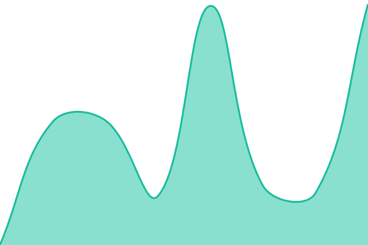
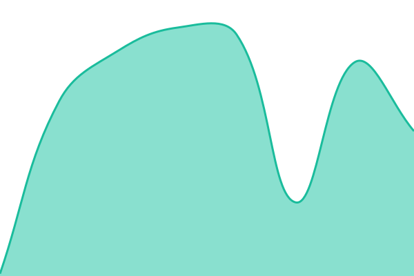
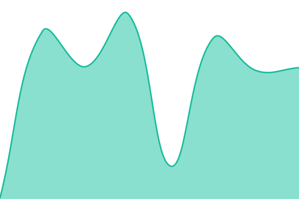

# [📈 Live Status](https://mesedi-ai.github.io/status): <!--live status--> **All systems operational**

This repository contains the open-source uptime monitor and status page for [mesedi-ai](https://mesedi-ai.github.io/status), powered by [Upptime](https://github.com/upptime/upptime).

With [Upptime](https://upptime.js.org), you can get your own unlimited and free uptime monitor and status page, powered entirely by a GitHub repository. We use [Issues](https://github.com/mesedi-ai/status/issues) as incident reports, [Actions](https://github.com/mesedi-ai/status/actions) as uptime monitors, and [Pages](https://mesedi-ai.github.io/status) for the status page.

<!--start: status pages-->
<!-- This summary is generated by Upptime (https://github.com/upptime/upptime) -->
<!-- Do not edit this manually, your changes will be overwritten -->
<!-- prettier-ignore -->
| URL | Status | History | Response Time | Uptime |
| --- | ------ | ------- | ------------- | ------ |
|  [mesedi-api.fly.dev (backend)](https://mesedi-api.fly.dev/health) | 🟩 Up | [mesedi-api-fly-dev-backend.yml](https://github.com/mesedi-ai/status/commits/HEAD/history/mesedi-api-fly-dev-backend.yml) | 

 99ms
     
 | 

<a href="https://mesedi-ai.github.io/status/history/mesedi-api-fly-dev-backend">100.00%</a>
    

|  [mesedi.vercel.app (marketing)](https://mesedi.vercel.app/) | 🟩 Up | [mesedi-vercel-app-marketing.yml](https://github.com/mesedi-ai/status/commits/HEAD/history/mesedi-vercel-app-marketing.yml) | 

 537ms
     
 | 

<a href="https://mesedi-ai.github.io/status/history/mesedi-vercel-app-marketing">100.00%</a>
    

|  [mesedi.vercel.app/pricing](https://mesedi.vercel.app/pricing) | 🟩 Up | [mesedi-vercel-app-pricing.yml](https://github.com/mesedi-ai/status/commits/HEAD/history/mesedi-vercel-app-pricing.yml) | 

 445ms
     
 | 

<a href="https://mesedi-ai.github.io/status/history/mesedi-vercel-app-pricing">100.00%</a>
    

|  [mesedi.vercel.app/app (customer dashboard)](https://mesedi.vercel.app/app) | 🟩 Up | [mesedi-vercel-app-app-customer-dashboard.yml](https://github.com/mesedi-ai/status/commits/HEAD/history/mesedi-vercel-app-app-customer-dashboard.yml) | 

 909ms
     
 | 

<a href="https://mesedi-ai.github.io/status/history/mesedi-vercel-app-app-customer-dashboard">100.00%</a>
    

|  [PyPI (mesedi python SDK)](https://pypi.org/project/mesedi/) | 🟩 Up | [py-pi-mesedi-python-sdk.yml](https://github.com/mesedi-ai/status/commits/HEAD/history/py-pi-mesedi-python-sdk.yml) | 

 76ms
     
 | 

<a href="https://mesedi-ai.github.io/status/history/py-pi-mesedi-python-sdk">100.00%</a>
    

|  [npm (mesedi TypeScript SDK)](https://registry.npmjs.org/mesedi) | 🟩 Up | [npm-mesedi-type-script-sdk.yml](https://github.com/mesedi-ai/status/commits/HEAD/history/npm-mesedi-type-script-sdk.yml) | 

 123ms
     
 | 

<a href="https://mesedi-ai.github.io/status/history/npm-mesedi-type-script-sdk">100.00%</a>
    

<!--end: status pages-->

[**Visit our status website →**](https://mesedi-ai.github.io/status)

## 📄 License

- Powered by: [Upptime](https://github.com/upptime/upptime)
- Code: [MIT](./LICENSE) © [Anand Chowdhary](https://anandchowdhary.com), supported by [Pabio](https://pabio.com)
- Data in the `./history` directory: [Open Database License](https://opendatacommons.org/licenses/odbl/1-0/)
